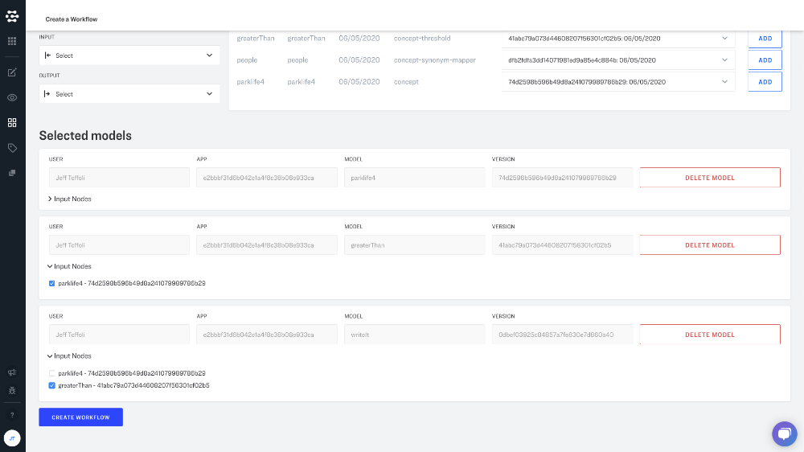

# Input Nodes

The outputs from one model can be used as the inputs in another model. This allows you to link together the models in a graph. Linking models helps you build sophisticated AI solutions, that can zero-in on a specific use case.

## Supported input and output types

To view your available models, just open your app and click Model Mode icon on the left hand side of the screen. From here just click the Create a Custom Model button in the top righthand corner of the screen.

Different models accept different types of inputs and return different types of outputs. They are named after the fields in the Data object of our API. This object is uses in inputs, annotations, models and workflows. Some examples include:

#### Inputs

* Concepts
* Embeddings
* Image
* Image or video
* Regions

#### Outputs

* Concepts
* Clusters
* Regions

## The building blocks

You can create workflows out of any Clarifai Models or custom models that you have created for your app. The inputs and outputs supported by your custom models will depend on the inputs and outputs supported by the Clarifai Models, or model templates that you have used to build them.

### Model Mode

Click the "four squares" icon on the lefthand sidebar to enter Model Mode.

### Create the custom models that you need

Click the blue `Create Custom Model` button at the top righthand corner of the screen to create any custom models that you might need for your app.

### Create your workflow

Click the blue `Create Custom Workflow` button at the top righthand corner of the screen build your new workflow. Just add the models that you would like to use in the sequence that you would like to have them in your workflow.

You can filter the available models by using the dropdown menus on the lefthand side of the screen. Change the user dropdown menu to "Clarifai" to view Clarifai Models.

### Connect your nodes

Finally you will need to connect the `Input Nodes` in your workflow. You can link your models to any models that precede them in the graph. Click "Create Workflow" and then you are ready to get started!

### Update your base workflow

To activate your new workflow in your app, head back to the "App Overview" page, and change your `Base Workflow` to the new workflow that you have just created and click the checkbox.

